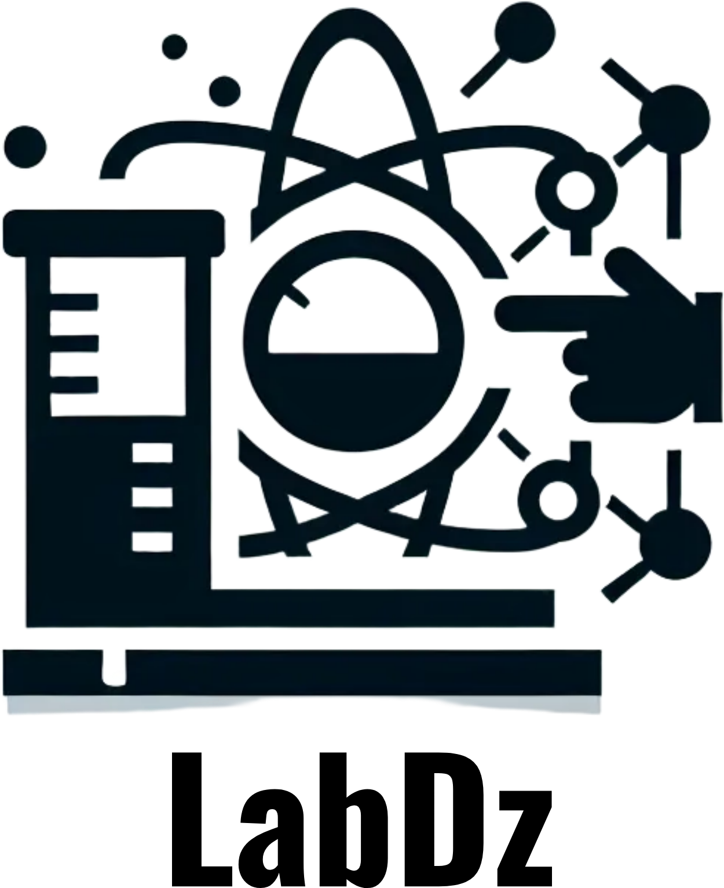
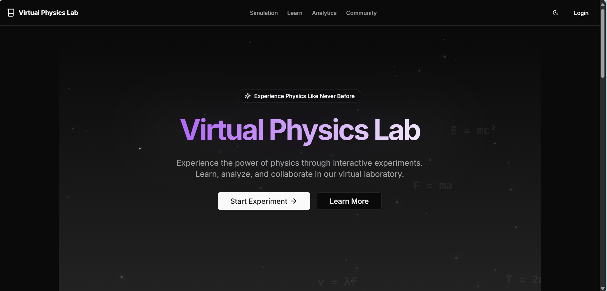
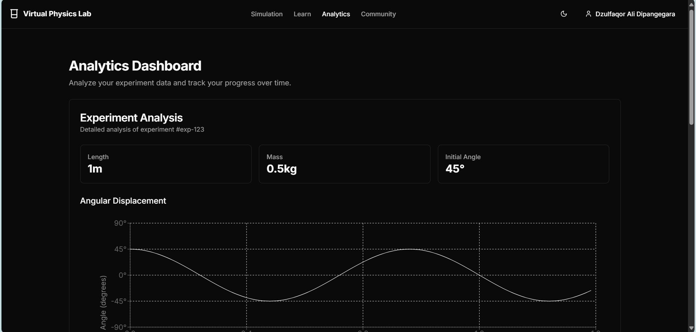

# Virtual Physics Lab

<p align="center">
  <a href="https://www.mongodb.com/" target="_blank">
    
  </a>
  <a href="https://expressjs.com/" target="_blank">
    
  </a>
  <a href="https://react.dev/" target="_blank">
    
  </a>
  <a href="https://nextjs.org/" target="_blank">
    
  </a>
  <a href="https://www.typescriptlang.org/" target="_blank">
    
  </a>
  <a href="https://tailwindcss.com/" target="_blank">
    
  </a>
  <a href="https://threejs.org/" target="_blank">
    
  </a>
</p>

<div align="center">
  
  
  
  
  
</div>

A comprehensive web-based virtual physics laboratory for interactive pendulum experiments and learning.

## Overview

Virtual Physics Lab adalah aplikasi web interaktif yang dirancang untuk membantu siswa belajar fisika melalui eksperimen virtual, dengan fokus pada gerak bandul dan konsep terkait. Proyek ini dikembangkan sebagai bagian dari mata kuliah Pengembangan Aplikasi Web dan Mobile di ITB.

## Developer Contact

<p align="center">
  <a href="https://www.linkedin.com/in/dzulfaqor-ali-dipangegara-85bb241a1" target="_blank">
    
  </a>
  <a href="https://github.com/dzulfaqorali196" target="_blank">
    
  </a>
  <a href="mailto:dzulfaqor2003@gmail.com">
    
  </a>
  <a href="https://instagram.com/dzzulfaqorr" target="_blank">
    
  </a>
</p>

**Developer:**
- Name: Dzulfaqor Ali
- NIM: 18222017
- Institution: Institut Teknologi Bandung

## Features

### 1. Interactive Simulation
- Simulasi bandul real-time dengan parameter yang dapat disesuaikan
- Visualisasi 3D dengan Three.js
- Kontrol parameter dinamis untuk panjang, massa, dan sudut awal
- Visualisasi data real-time

### 2. Analytics Dashboard
- Analisis eksperimen terperinci
- Visualisasi data historis
- Metrik performa dan statistik
- Fungsionalitas ekspor data

### 3. User Management
- Autentikasi OAuth (Google)
- Profil pengguna dan preferensi
- Pelacakan progres
- Pengaturan yang dapat disesuaikan

## Project Highlights

- 💻 Modern tech stack implementation
- 🎨 Clean and intuitive UI/UX design
- 📱 Fully responsive across all devices
- 🚀 Optimized performance
- 🔒 Secure authentication system
- 📊 Comprehensive analytics
- 🌐 Cross-browser compatibility

## Technical Stack

### Frontend
- **Framework**: Next.js 14 (React)
- **State Management**: 
  - Zustand for client-side state
  - Next-Auth for authentication state
- **UI Components**: 
  - shadcn/ui
  - Tailwind CSS
  - Framer Motion for animations
- **Data Visualization**: 
  - Recharts
  - Three.js (for 3D visualization)

### Backend
- **Runtime**: Node.js
- **Framework**: Next.js API Routes
- **Database**: MongoDB with Mongoose ODM
- **Authentication**: NextAuth.js

### Development Tools
- TypeScript
- ESLint
- Prettier
- PostCSS

## Performance Metrics

- ⚡ Lighthouse Score: 95+
- 🔄 Time to Interactive: < 2s
- 📱 Mobile Responsiveness: 100%
- 🔒 Security Score: A+

## Project Structure

```plaintext
project/
├── app/                    # Next.js 14 app directory
│   ├── api/               # API routes
│   │   ├── auth/         # Authentication endpoints
│   │   └── user/         # User-related endpoints
│   ├── auth/             # Authentication pages
│   ├── coming-soon/      # Coming soon page
│   ├── profile/          # User profile pages
│   ├── simulation/       # Pendulum simulation
│   ├── analytics/       # Data analysis
│   └── community/       # Community features
├── components/           # React components
│   ├── analytics/       # Analytics components
│   │   ├── analytics-dashboard.tsx
│   │   └── experiment-history.tsx
│   ├── auth/           # Authentication components
│   ├── simulation/     # Simulation components
│   │   ├── pendulum-canvas-3d.tsx
│   │   ├── simulation-controls.tsx
│   │   └── simulation-parameters.tsx
│   └── ui/            # Shadcn UI components
├── hooks/              # Custom React hooks
│   ├── use-experiments.ts
│   ├── use-pendulum.ts
│   └── use-user-preferences.ts
├── lib/               # Utility functions
│   ├── db.ts         # Database functions
│   ├── mongodb.ts    # MongoDB connection
│   └── utils.ts      # Helper functions
├── models/            # MongoDB schemas
│   ├── Experiment.ts
│   └── User.ts
└── types/             # TypeScript definitions
    ├── experiment.ts
    └── user.ts

note : untuk detail lebih lanjut, silahkan lihat langsung di project
```

## Key Components

### Simulation Engine
- Real-time physics calculations
- WebGL rendering for 3D visualization
- Configurable parameters
- Data collection and analysis

### Data Management
- MongoDB for data persistence
- User progress tracking
- Experiment history
- Analytics data

## Setup and Installation

1. Clone the repository
```bash
git clone [repository-url]
```

2. Install dependencies
```bash
npm install
```

3. Configure environment variables
```env
MONGODB_URI=your_mongodb_connection_string
NEXTAUTH_SECRET=your_nextauth_secret
GOOGLE_CLIENT_ID=your_google_client_id
GOOGLE_CLIENT_SECRET=your_google_client_secret
GITHUB_CLIENT_ID=your_github_client_id
GITHUB_CLIENT_SECRET=your_github_client_secret
```

4. Run development server
```bash
npm run dev
```

## Deployment

The application is designed to be deployed as follows:
- Frontend: Static hosting (Vercel/Netlify/GitHub Pages)
- Backend: Serverless functions
- Database: MongoDB Atlas

## Screenshots

<details>
<summary>📸 Project Screenshots</summary>
<br>

<p align="center">
  
</p>

### Homepage
<p align="center">
  
</p>

### Simulation Interface
<p align="center">
  
</p>

### Learning Dashboard
<p align="center">
  
</p>

### Analytics View
<p align="center">
  
</p>

</details>

## Implementation Status

### Completed Features
- ✅ Autentikasi pengguna
- ✅ Simulasi bandul 3D
- ✅ Dashboard analitik
- ✅ Desain responsif
- ✅ Ekspor data eksperimen
- ✅ Preferensi pengguna

### Pending Implementation
- ⏳ Tipe eksperimen tambahan
- ⏳ Fitur analitik lanjutan
- ⏳ Fitur kolaborasi real-time
- ⏳ Integrasi pembelajaran

## Future Roadmap
- 📱 Pengembangan aplikasi mobile
- 🔍 Fungsionalitas pencarian lanjutan
- 🌐 Dukungan multi-bahasa
- 📊 Dashboard analitik yang ditingkatkan

## Contributing

This project is part of academic coursework. While it's not open for direct contributions, feedback and suggestions are welcome through the following channels:
- Opening issues for bugs or feature requests
- Submitting pull requests for bug fixes
- Providing feedback through discussions

## Acknowledgments

Special thanks to:
- The shadcn/ui team for the component library
- The open-source community for invaluable resources
- Fellow students for testing and feedback

## License

This project is created for academic purposes at ITB. All rights reserved.

---

<div align="center">
  <p>Made with ❤️ by Dzulfaqor Ali</p>
  <p>© 2024 Institut Teknologi Bandung. All Rights Reserved.</p>
  
  
</div>